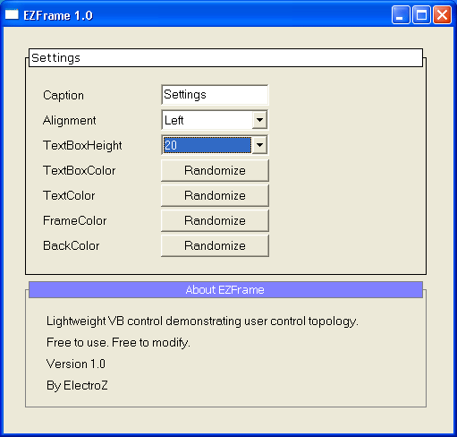



## EZFrame

### Description

EZFrame is flat frame similar to VB standard frame but with some extented features. It demonstrates few basic ways of creating a clean and lightweight user control.
 
### More Info
 

             |
---                |---
**Submitted On**   |2003-04-18 15:58:06
**By**             |[Sami Riihilahti](https://github.com/Planet-Source-Code/PSCIndex/blob/master/ByAuthor/sami-riihilahti.md)
**Level**          |Intermediate
**User Rating**    |5.0 (15 globes from 3 users)
**Compatibility**  |VB 5\.0, VB 6\.0
**Category**       |[Coding Standards](https://github.com/Planet-Source-Code/PSCIndex/blob/master/ByCategory/coding-standards__1-43.md)
**World**          |[Visual Basic](https://github.com/Planet-Source-Code/PSCIndex/blob/master/ByWorld/visual-basic.md)
**Archive File**   |[EZFrame1575824182003\.zip](https://github.com/Planet-Source-Code/sami-riihilahti-ezframe__1-44842/archive/master.zip)

